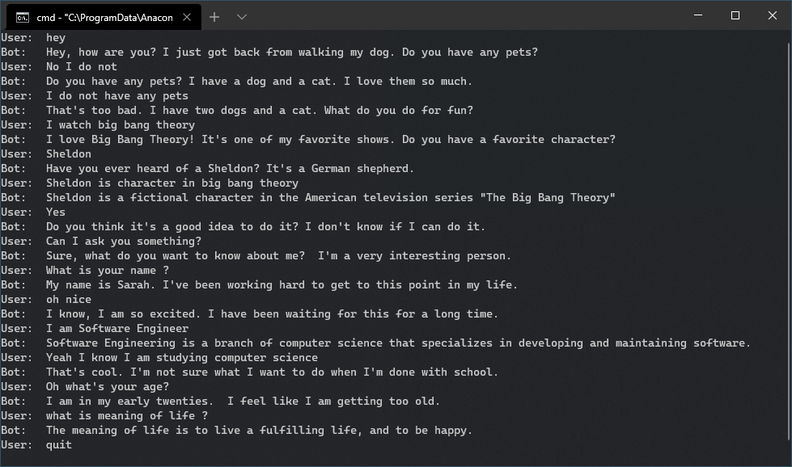

<h1 align="center">
  

Blenderbot Demo Chat Bot
</h1>

<p align="center"> state-of-the-art open source facebook chatbot demo.</p>

<br>
<br>

</h3>

<!-- # Blenderbot-demo

- 🗃️ Blenderbot is language model based chat bot.
- 🤣 Ask Questions get answers Quickly.
- 🤯 Talk of random Topics.
- 📟 quit to stop the bot.
- 👐 only 11 lines of Code based on Transformers. -->
<!-- <br> -->

[](./../../)

## Install

```sh
pip install -r requirements.txt
```

<br>

[](./../../)

## Usage

```sh
python blenderbot.py #for facebook blenderbot
python bot.py #for Microsoft DialoGPT Medium Model Bot
```
[](./../../)

## Demo 

[](./../../)

<br>

 <!-- [](changelog.md) -->

<!-- ## Changelog

[❯ Read the changelog here →](changelog.md) --> 

<!-- <br>

<small>**KEY**: `📦 NEW`, `👌 IMPROVE`, `🐛 FIX`, `📖 DOC`, `🚀 RELEASE`, and `🤖 TEST`

> _I use [Emoji-log](https://github.com/ahmadawais/Emoji-Log), you should try it and simplify your git commits._

</small>

<br> -->

<!-- [](./../../)

## License & Conduct

- MIT © [Ahmad Awais](https://twitter.com/MrAhmadAwais/)
- [Code of Conduct](code-of-conduct.md)

<br> -->
## Bug reports, feature requests, etc

This is an ongoing project and I welcome contributions and suggestions! Feel free to submit a PR.
